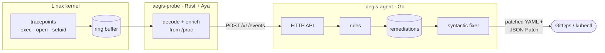

# aegis-ebpf

Autonomous Cloud-Native Runtime Security &amp; Self-Healing.

Aegis-eBPF watches what containers do from inside the Linux kernel and turns
dangerous behavior into concrete fixes for the Kubernetes workloads that
caused it: when a container writes to `/etc`, the answer is a patch that mounts
its root filesystem read-only.



## Components

| Path | Language | Role |
| --- | --- | --- |
| [`crates/aegis-probe-ebpf`](crates/aegis-probe-ebpf) | Rust (`no_std`, [Aya](https://aya-rs.dev)) | Passive eBPF programs attached to kernel tracepoints. They write audit records in place into a `BPF_MAP_TYPE_RINGBUF`. |
| [`crates/aegis-probe-common`](crates/aegis-probe-common) | Rust (`no_std`) | `#[repr(C)]` records shared by the kernel and user-space sides. |
| [`crates/aegis-probe`](crates/aegis-probe) | Rust (Aya, Tokio) | Loads and attaches the programs, decodes the records into `AuditEvent`s, resolves the container of each process from `/proc`, and sends them to the agent in batches. |
| [`cmd/aegis-agent`](cmd/aegis-agent) | Go | The control plane: ingests events, classifies them, enriches them with pod identity, keeps remediations, and serves the API and the live stream ([`internal/agent`](internal/agent)). |
| [`internal/fixer`](internal/fixer) | Go | The syntactic engine: rules that map events to hardening plans, and the engine that applies those plans to manifests. |
| [`internal/events`](internal/events) | Go | The `AuditEvent` type, its payloads and their validation. |
| [`internal/k8s`](internal/k8s) | Go | A read-only, in-cluster Kubernetes client that resolves the pod a container belongs to. |
| [`internal/decoy`](internal/decoy) | Go | The opt-in honeypot responder: deploys an inert decoy on high-severity events. |
| [`web/`](web) | React, Vite, Tailwind | The dashboard: a live audit console over the WebSocket stream. |
| [`deploy/k8s/`](deploy/k8s) | Kubernetes | DaemonSet, RBAC and namespace manifests. |
| [`api/openapi.yaml`](api/openapi.yaml) | OpenAPI 3.0 | Contract of the events and of the agent API. |

## Audit events and detections

The probe is strictly passive: its eBPF programs only read syscall
arguments and write to the probe's own maps. They never write process
memory, block or alter a syscall, or signal a process.

| Event (`kind`) | Kernel hook | What it records | Rule | Fix proposed for the container |
| --- | --- | --- | --- | --- |
| `process_exec` | `syscalls:sys_enter_execve` | Program path and its first 16 arguments | AEG-001 · root process in a container (medium) | `securityContext.runAsNonRoot: true` |
| `privilege_escalation` | `syscalls:sys_{enter,exit}_set{,re,res}uid` | Syscall and the UIDs before and after | AEG-002 · real UID changed to 0 (critical) | `allowPrivilegeEscalation: false`, `capabilities.drop: [ALL]` |
| `file_open` | `syscalls:sys_enter_{openat,openat2,open,creat}` | Path and flags of opens with write intent | AEG-003 · write under `/etc`, `/usr`, `/bin`… (high) | `readOnlyRootFilesystem: true` |
| `network_connect` | `syscalls:sys_enter_connect` | Destination IPv4 or IPv6 address and port | — (audit only) | — |
| `ptrace` | `syscalls:sys_enter_ptrace` | Request, target PID and address | — (audit only) | — |

Only processes that run in a container are reported by default: the probe
recognizes the cgroups of Docker, containerd, CRI-O and Podman, and the pod
UID under Kubernetes. The probe does not audit its own activity. Each rule
opens one remediation per container; later matches increase its
`occurrences`.

## The syntactic fixer

A plan is a list of operations whose paths are relative to the pod spec, so
the same plan fixes a Pod, a Deployment or a CronJob:

```json
{"op": "set", "path": "containers[name=web].securityContext.allowPrivilegeEscalation", "value": false}
{"op": "add", "path": "containers[*].securityContext.capabilities.drop", "value": "ALL"}
```

The engine parses these paths (`segment[selector].segment…`, where a selector
is `*`, an index or `field=value`) and edits the YAML syntax tree of the
manifest rather than re-serializing Go structs:

- comments, key order and quoting survive; the indentation and list style of
  each edited document are detected and kept;
- documents that do not change, such as a `Service` next to the `Deployment`,
  are copied byte for byte;
- every edit is also returned as an RFC 6902 JSON Patch, ready for
  `kubectl patch --type=json`;
- applying a plan twice changes nothing.

## Build

Everything builds in Docker; the host needs Docker Engine 23 or later.

```sh
make            # compile both binaries into ./bin and build both images
make test       # gofmt, go vet, Go tests, rustfmt, clippy, Rust tests, OpenAPI lint
make help       # every target
```

| Target | Result |
| --- | --- |
| `make build` | `bin/aegis-agent` and `bin/aegis-probe` |
| `make images` | `ghcr.io/sanabriadiosnel86-dotcom/aegis-{agent,probe}:<version>` |
| `make build-web` | The dashboard into `web/dist` |
| `make test-go` | Go checks, including contract tests that validate every API exchange against `api/openapi.yaml` |
| `make test-rust` | Rust checks |
| `make test-web` | The dashboard's typecheck and build |
| `make lint-api` | Redocly lint of the OpenAPI specification |

The dashboard is bundled into the agent image (served with
`-web-dir /usr/share/aegis/web`), so `make images` builds it too. Set
`VERSION`, `REGISTRY` or `BUILD_FLAGS` (e.g. `BUILD_FLAGS=--platform=linux/arm64`)
to override the defaults.

## Run

`make up` starts the agent and the probe on the local Docker host with
[`deploy/compose.yaml`](deploy/compose.yaml) and serves the dashboard at
<http://127.0.0.1:8080>. The probe runs privileged in the
PID namespace of the host; it needs Linux 5.8 or later and tracefs mounted on
the host's `/sys/kernel/tracing`, which it reads through a read-only mount.
Where tracefs is missing, `aegis-probe --mount-tracefs` mounts it; the probe
never does so on its own. Then:

```sh
docker run --rm alpine sh -c 'echo pwned > /etc/motd'

curl -s 'http://127.0.0.1:8080/v1/events?min_severity=high'
curl -s  http://127.0.0.1:8080/v1/remediations

# Render a remediation against the manifest of the workload.
curl -s -X POST http://127.0.0.1:8080/v1/remediations/<id>/patch \
  -H 'Content-Type: application/yaml' --data-binary @deployment.yaml
```

`aegis-probe --agent-url -` prints the events as JSON lines instead of sending
them, which helps when working on the probe; `aegis-probe --help` lists its
other options.

## Dashboard

The agent serves a real-time audit console. It subscribes to
`GET /v1/stream`, a WebSocket that pushes every `AuditEvent` as it is
ingested, and shows a live feed, per-severity counters and a graph that ties
each event's pod, process and syscall together. It is a dark, single-page
React app in [`web/`](web); `make images` bundles it into the agent image, and
`make up` serves it at <http://127.0.0.1:8080>. During development,
`cd web && npm install && npm run dev` runs it against an agent on
`127.0.0.1:8080` with hot reload.

## Kubernetes

[`deploy/k8s/`](deploy/k8s) runs Aegis-eBPF as a DaemonSet: one pod per node
with the probe (privileged, `hostPID`, tracefs mounted read-only) and the
agent side by side. The agent resolves the pod that owns each container
through the Kubernetes API, using a read-only `ServiceAccount` that may only
`get`, `list` and `watch` pods and namespaces, and fills `container.pod` (name
and namespace) on every event.

```sh
make images VERSION=v1              # build and push these to your registry
make deploy-k8s VERSION=v1 REGISTRY=ghcr.io/you
kubectl -n aegis get daemonset
```

`make deploy-k8s` applies the namespace, the RBAC and the DaemonSet,
substituting the image reference. Enrichment is enabled with the agent's
`-enrich-k8s` flag, which the DaemonSet sets.

## Adaptive deception (opt-in)

The agent can answer high-severity events with a honeypot. With `--decoy`, when
an event reaches `high` or `critical` severity in a container, the
[`internal/decoy`](internal/decoy) responder starts a lightweight decoy beside
the offending workload, to catch lateral-movement probes. It picks its backend
from where the agent runs:

- **Kubernetes** (with `-enrich-k8s`): it creates an ephemeral decoy **pod in
  the offending pod's namespace**, hardened (non-root, read-only root
  filesystem, all capabilities dropped, no ServiceAccount token) and bounded by
  `activeDeadlineSeconds`. This needs the extra, opt-in RBAC in
  [`deploy/k8s/decoy-rbac.yaml`](deploy/k8s/decoy-rbac.yaml).
- **Docker**: it starts a decoy container on the **same network** as the
  offending container, through the Docker socket.

The decoy is deliberately inert in both cases: it presents a fake SSH banner,
logs the source of every connection, and never runs anything a client sends.
It is the only component that changes state, which is why it is off by default;
connections to it also show up as ordinary `network_connect` audit events.
Deployments are deduplicated per container, rate-limited and capped, and the
decoys are removed when the agent stops.

## Develop without Docker

- Go 1.26 or later: `go test ./...`
- Rust stable, plus a nightly toolchain with `rust-src` and
  [`bpf-linker`](https://github.com/aya-rs/bpf-linker), which compile the eBPF
  programs: `cargo test`, then `sudo ./target/debug/aegis-probe`.
  Formatting uses nightly rustfmt: `cargo +nightly fmt`.
- Dashboard: `cd web && npm install && npm run build` (or `npm run dev`).

## Current limits

- The API has no authentication yet: keep the agent on loopback or on a
  network that only the probe reaches. The event stream is likewise open.
- Events and remediations live in memory, bounded, and are lost on restart.
- The container of a process is read from `/proc` when its event arrives, so
  events of very short-lived processes may lose it.
- Container names are not resolved yet; without the container name, plans
  target every container of the pod. Pod names are resolved in Kubernetes
  through the API, keyed by container ID, and appear once the pod cache has
  seen the container.
- The Kubernetes decoy needs the offending pod's namespace, which comes from
  enrichment, so it only fires for events the pod cache has already resolved.
- `process_exec` is recorded when `execve(2)` enters the kernel: attempts that
  fail, such as a program looked up along `PATH`, are recorded too, and
  `process.comm` names the calling process. Arguments are captured up to 16,
  of up to 127 bytes each; `argv_truncated` flags longer command lines.
- The `target_pid` of a `ptrace` event is in the caller's PID namespace, so
  inside a container it differs from the node-level `process.pid`.

## License

MIT. The eBPF programs in `crates/aegis-probe-ebpf` are dual-licensed MIT or
GPL-2.0, as the kernel only lets GPL-compatible programs use helpers such as
`bpf_probe_read_user_str`.
